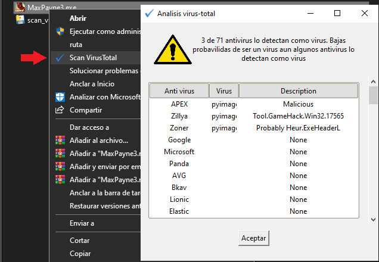

# gui-virustotal

si se instala:
agrega al menu contextual una ocion para escanear un archivo con virustotal

si no lo instala, puede utilizarlo desde la terminal ruta/de/scan_virustotal.exe /ruta/del/archivo
